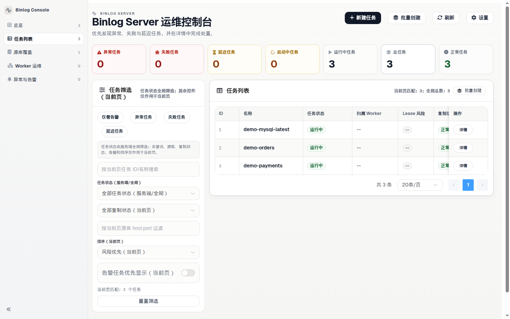
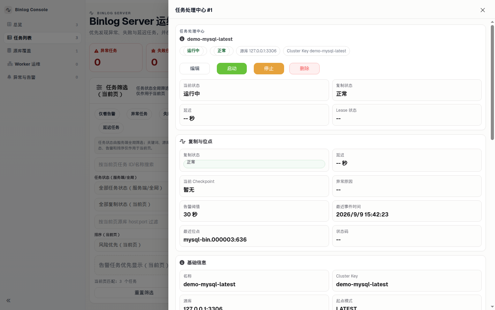
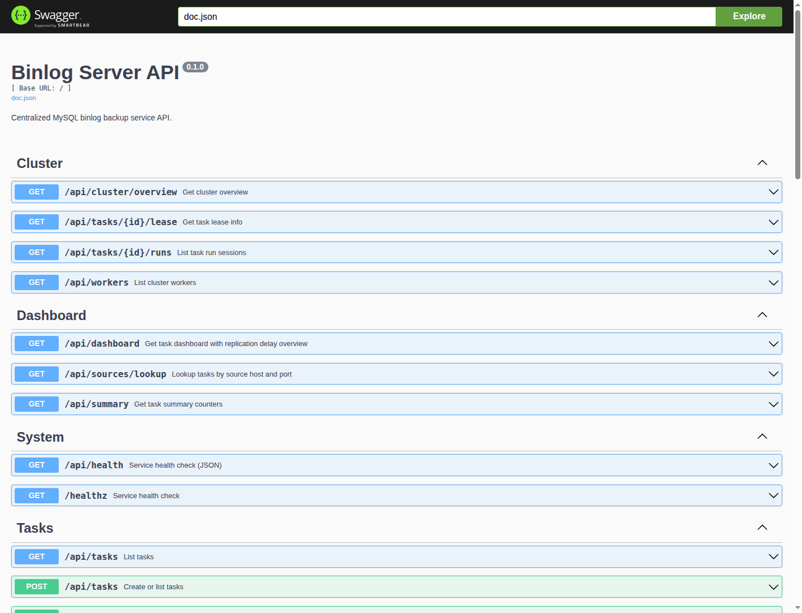

<div align="center">
  <div style="display:inline-block; text-align:left;">
    <pre>
 ____                  ___                       ____
/\  _`\    __         /\_ \                     /\  _`\
\ \ \L\ \ /\_\    ___ \//\ \     ___      __    \ \,\L\_\     __   _ __   __  __     __   _ __
 \ \  _ <'\/\ \ /' _ `\ \ \ \   / __`\  /'_ `\   \/_\__ \   /'__`\/\`'__\/\ \/\ \  /'__`\/\`'__\
  \ \ \L\ \\ \ \/\ \/\ \ \_\ \_/\ \L\ \/\ \L\ \    /\ \L\ \/\  __/\ \ \/ \ \ \_/ |/\  __/\ \ \/
   \ \____/ \ \_\ \_\ \_\/\____\ \____/\ \____ \   \ `\____\ \____\\ \_\  \ \___/ \ \____\\ \_\
    \/___/   \/_/\/_/\/_/\/____/\/___/  \/___L\ \   \/_____/\/____/ \/_/   \/__/   \/____/ \/_/
                                          /\____/
                                          \_/__/
    </pre>
  </div>
</div>

<div align="center">
# BinlogServer

[](https://github.com/Fanduzi/BinlogServer/releases)

[](LICENSE)

[](README.md)
[](README_ZH.md)
[](CHANGELOG.md)
[](SECURITY.md)
</div>

BinlogServer 是专为数据库运维与 DBA 团队打造的**集中式 MySQL Binlog 备份控制平面**。它负责从 MySQL / MariaDB 源库持续拉取 binlog 流落盘为本地文件，严格在本地 `fsync` 成功后提交 Checkpoint 位点，通过元数据库分布式租约实现多节点 Worker 自动故障切换，并提供解耦的兼容 S3 对象存储归档、内嵌运维 Web 控制台与完整的 REST API。

如果你正在评估 BinlogServer 是否适合业务场景，请先阅读下方的**四大架构设计保证**与**推荐部署架构**；如果你需要立即上线部署，可直接跳转至 **Quick Start**。

---

## 解决的核心痛点

在很多生产环境中，MySQL binlog 的备份仍然依赖于维护困难的 `mysqlbinlog` 散装脚本、缺少位点漂移追踪的 Crontab 任务，以及因为对象存储网络波动而反压导致复制被卡死的脆弱流程。

BinlogServer 将这些痛点彻底收敛为标准的控制面基础设施：
- **无虚假乐观进度：** Checkpoint 位点严格在本地文件 `fsync` 刷盘成功后方才推进。
- **解耦异步归档：** 远端 S3 / MinIO 对象存储的抖动、限流或不可用，绝不反压阻断本地核心 binlog 复制流。
- **集群租约故障自愈：** 基于 MySQL 元数据表的排他分布式租约，确保同一任务在任意时刻仅有一个 Worker 执行拉取，节点崩溃自动心跳超时接管。
- **生产透明可观测：** 内嵌运维 Web 控制台、交互式 Swagger API 与 Prometheus `/metrics`，延迟计算直接对比源库 `SHOW MASTER STATUS` / `SHOW BINLOG STATUS` 实时位点。

### 控制台与运维界面预览


*控制台概览：实时监控所有源实例的复制延迟、分段进度、Worker 归属与任务运行状态。*


*任务透视抽屉：清晰查看当前 GTID / File-Pos 位点、本地文件轮转记录，并支持对失败文件一键触发重试。*


*Swagger API 浏览器：完整的 OpenAPI 交互规范，便于无缝对接内部自动化运维平台与 CMDB。*

---

## 四大架构设计保证 (DBA First)

| 保证维度 | 底层工程实现 | 为什么 DBA 能放心使用 |
|---|---|---|
| **fsync 强一致检查点** | 仅在当前分段成功完成本地操作系统 `fsync` 刷盘后，元数据库或内存中的 Checkpoint 位点才被推进。 | 杜绝内存虚假推进。进程崩溃或服务器意外掉电重启后，任务必定能够从可靠落盘的字节位置精准续传。 |
| **解耦异步归档** | S3 / MinIO 上传逻辑完全异步执行。上传遇到网络波动或对象存储故障时自动退避重试，并提供 API 与界面补传入口。 | 任何云存储服务故障或限流，绝不会牵连本地拉流核心链路，保障源库 binlog 持续快速腾挪。 |
| **集群租约与防脑裂** | 基于独立元数据 MySQL 的分布式行级排他租约，并配合心跳持续续租。 | 杜绝多个节点同时拉取同一源库导致文件覆盖与网络浪费；Worker 故障停机后，其余健康节点在租约过期后自动竞态接管。 |
| **严密 Fail-Closed 安全机制** | 非 Loopback 开放监听端口强制开启鉴权。设置 `PRODUCTION=true` 时，若未提供 32 字节 AES 密钥（`--encryption-key`）直接拒绝监听启动。 | 源库连接口令在元数据库中强制以 AES-256-GCM（`enc:aes256:`）密文存储；杜绝无认证控制面被暴露到公网。 |
| **真实主库位点延迟** | 复制延迟计算直接比对源库当前的 `SHOW MASTER STATUS` 真实位点，而非仅参考 Binlog 事件 Header 中的历史时间戳。 | 彻底规避业务空闲期、夜间低峰期由时间戳静止引发的“虚假零延迟”或误告警。 |

---

## 推荐部署架构

BinlogServer 提供三种灵活的运行形态，完美契合不同规模与可用性要求：

1. **单机独立模式 (Standalone):**
   - *未配置 `meta_dsn` 时：* 任务元数据与位点保存在内存，binlog 文件落盘在 `{data_dir}/{task_id}/`，适合本地开发验证。
   - *配置 `meta_dsn` 后：* 任务配置、位点与文件生命周期持久化至独立 MySQL，进程重启后自动接续断点，适合单机生产备份。
2. **控制面 + Worker 集群架构 (推荐生产方案):**
   - *Control Plane 节点 (`cluster.role: control-plane`):* 专职暴露 REST API、Web 控制台与调度器，不执行复制拉取。
   - *Worker 节点池 (`cluster.role: worker`):* 无状态工作节点，周期性上报心跳、竞争认领任务租约并执行拉流与落盘，节点故障平滑自动转移。
3. **一体化集群节点 (`cluster.role: all-in-one`):**
   - 单进程同时提供 API 控制面与本地 Worker 执行引擎，所有节点连接共享元数据 MySQL，适合资源紧凑的 2~3 节点高可用架构。

---

## Quick Start (面向生产运维)

发布包内提供编译好的静态二进制，部署机无需安装 Go 语言环境。

### 前置条件

- 从 [GitHub Releases](https://github.com/Fanduzi/BinlogServer/releases) 下载匹配当前操作系统与 CPU 架构的发布包。
- 一台已启用 `log_bin=ON`、`binlog_format=ROW` 的 MySQL 或 MariaDB 源库，并创建复制账号（`GRANT REPLICATION SLAVE, REPLICATION CLIENT ON *.*`）。MariaDB 必须提交 `"flavor":"mariadb"`。`mysql` 会去读 `@@server_uuid`，MariaDB 没有这个变量。

> ⚠️ **元数据库隔离红线：** 配置 `meta_dsn` 时，该 MySQL 实例必须独立部署，且**绝对不能**加入到备份任务集中。服务在启动与创建任务时会强校验 TCP `host:port` 与 Loopback 别名（`localhost`、`127/8`、`::1`），防止自引用死锁。

### 1. 下载、校验并解压 v0.5.38

```bash
VER=0.5.38
OS=linux          # linux | darwin
ARCH=amd64        # amd64 | arm64

curl -fsSL -O "https://github.com/Fanduzi/BinlogServer/releases/download/v${VER}/binlog-server_${VER}_${OS}_${ARCH}.tar.gz"
curl -fsSL -O "https://github.com/Fanduzi/BinlogServer/releases/download/v${VER}/checksums.txt"
sha256sum -c checksums.txt --ignore-missing

tar -xzf "binlog-server_${VER}_${OS}_${ARCH}.tar.gz"
cd "binlog-server_${VER}_${OS}_${ARCH}"
```

已发布的 `v0.5.38` `checksums.txt`：

```text
b7523c78fc1065479fcbbd0178d83513c4ee7106eb73091df9c1e4d379ecf5e7  binlog-server_0.5.38_darwin_amd64.tar.gz
400caf0ce4cdb62b6f9d28683a733335be59d2916e04f3bf7b30241a039ee373  binlog-server_0.5.38_darwin_arm64.tar.gz
78336586b61cf5c063dde23d02f21952cc365358c9716b267119fb76a82fbd81  binlog-server_0.5.38_linux_amd64.tar.gz
e76be4227bb4de469f396f8e56eff245da1bf14aa9cd5ab074dae60bc6d91ff9  binlog-server_0.5.38_linux_arm64.tar.gz
```

发布包解压后的真实目录结构如下：

```text
binlog-server_0.5.38_linux_amd64/
  binlog-server                  # 服务主二进制程序
  migrate                        # 数据库 Schema 迁移工具
  migrations/                    # SQL 结构迁移脚本
  README.md                      # 英文文档
  README_ZH.md                   # 中文文档
  CHANGELOG.md                   # 版本更新记录
  LICENSE                        # Apache 2.0 开源协议
  config.example.yaml            # 完整参数参考配置
  config.production.example.yaml # 生产安全推荐模板
  docs/guide/                    # 运维指南，含本地分段回放
```

### 2. 本地快速体验 (Loopback 监听)

```bash
# 绑定到 127.0.0.1 允许免鉴权快速启动演示
export BINLOG_SERVER_LISTEN_ADDR=127.0.0.1:8080
export BINLOG_SERVER_DATA_DIR=./data
./binlog-server
```

*注意：* 服务默认监听地址为 `:8080`。任何非本地 Loopback 地址（包括 `0.0.0.0:8080` 与默认 `:8080`）启动时必须配置 `api.auth.enabled: true`，否则严格 Fail-Close 退出。

### 3. 验证健康检查端点

```bash
curl -fsS http://127.0.0.1:8080/healthz
# 期望返回: ok
```

### 4. 提交第一个备份任务

调用 `POST /api/tasks` 接口录入任务信息：

```bash
curl -fsS -X POST http://127.0.0.1:8080/api/tasks \
  -H 'Content-Type: application/json' \
  -d '{
    "name": "prod-mysql-01",
    "cluster_key": "prod-cluster-main",
    "source": {
      "host": "192.168.1.50",
      "port": 3306,
      "user": "repl",
      "password": "your_repl_password",
      "flavor": "mysql"
    },
    "start": {
      "mode": "LATEST"
    },
    "storage": {
      "retention_days": 7
    }
  }'
```

*重要参数说明：*
- `cluster_key`: 集群标识，用于元数据分群和 S3 对象路径路由，仅允许 `[A-Za-z0-9._-]`。
- `source.flavor`: `mysql` 或 `mariadb`。MariaDB 源库必须写 `"flavor":"mariadb"`。保持 `mysql` 会在启动时以 `SOURCE_IDENTITY_UNAVAILABLE` 失败，因为 MariaDB 没有 `@@server_uuid`。
- `start.mode`: 启动起点，可选 `LATEST`（从源库最新位点）、`FILE_POS`（需提供 `file` 和 `pos`）或 `GTID`（需提供 `gtid_set`）。
- `storage.retention_days`: 保留天数（有效范围 1..3650 天）。省略 `local_retention_days` 和 `bucket_retention_days` 时，这一个数同时是本地磁盘保留和桶保留。
- `storage.local_retention_days`: 可选。封存文件留在本地磁盘的天数。`0` 或省略时等于 `retention_days`。
- `storage.bucket_retention_days`: 可选。已上传对象和目录行留下的天数。`0` 或省略时等于 `retention_days`。必须大于或等于本地保留。只有同时配了上传和 `meta_dsn` 才生效。

### 5. 启动任务开始复制

将 `<task-id>` 替换为创建任务接口返回的 `id`：

```bash
curl -i -X POST http://127.0.0.1:8080/api/tasks/<task-id>/start
```

任务处于 `RUNNING`、`STARTING`、`LEASE_DEGRADED` 或 `RETRY_BACKOFF` 时，这次拉流用的是启动时的源库、起点、保留和 `cluster_key`。`PUT /api/tasks/<task-id>` 要改这四项里的任何一项，会返回 HTTP 400，正文是 `stop the task before changing source, start, storage, or cluster_key`。先停掉，再更新，再启动。下次启动从已有 checkpoint 续上。只改名字可以通过。监听地址这类进程配置不在这次更新里。

### 6. 查看状态与访问控制台

- **Web 控制台:** 浏览器访问 `http://127.0.0.1:8080/ui/`
- **Swagger 调试页面:** 浏览器访问 `http://127.0.0.1:8080/swagger/index.html`
- **API 查询任务:** `curl -fsS http://127.0.0.1:8080/api/tasks`

---

## 生产部署安全检查清单

生产上线前必须严格覆盖以下安全与架构基线：

### 1. 严格 Fail-Closed 安全与加密密钥
- **开放端口必须鉴权:** 只要监听地址不是 Loopback，必须配置 `api.auth.enabled: true` 并同时开启 `protect_api` 与 `protect_metrics`。
- **`PRODUCTION=true` 强制限制:** 当设置 `PRODUCTION=true` 环境变量时，进程在 `--encryption-key` 为空时将直接退出并不监听端口。
- **生成 32 字节 AES 密钥:** 启动时通过命令行参数传入：
  ```bash
  export BINLOG_SERVER_ENCRYPTION_KEY="$(openssl rand -hex 16)" # 32 个十六进制字符 = 32 字节
  ./binlog-server --config config.production.example.yaml --encryption-key "$BINLOG_SERVER_ENCRYPTION_KEY"
  ```
- **口令落库加密:** 传入 `--encryption-key` 后，元数据库中任务配置的 `source_json` 源库密码会自动以 AES-256-GCM（`enc:aes256:`）密文存储。
- **控制台:** 浏览器直接打开 `/ui/`。页面和静态资源不要求 `Authorization` 头。`/api/*` 返回 401 时会弹出设置框，把 `api.auth.bearer_token` 配的 bearer token 粘进去。之后控制台请求带 `Authorization: Bearer`。`/api/*`、`/metrics`、`/swagger/*` 未带凭证仍然 401。`/healthz` 保持开放，给负载均衡探活。Swagger 页面没有填写 token 的入口，用 curl 或在反向代理里注入请求头。设置框里填的是 bearer token。`api_key` 模式给能自己带对应请求头的客户端用。

### 2. 元数据库独立与迁移
- 准备独立的 MySQL 元数据库并在启动前执行 Schema 初始化：
  ```bash
  export META_DSN='binlog_meta:secure_pass@tcp(10.0.0.15:3306)/binlog_server_meta?parseTime=true'
  ./migrate up --dsn "$META_DSN" --path ./migrations
  export BINLOG_SERVER_META_DSN="$META_DSN"
  ```

### 3. 本地保留与对象存储归档
- 本地分段文件保存在 `{data_dir}/{task_id}/`。
- 复制循环打开文件时会清理超过 `storage.retention_days` 的过期已封存分段。正在写入的 `OPEN` 分段不会被删除。这次保留清理也不删除其它 open 分段，也不删它们的对象。已经上传的封存分段会在同一次清理里从桶中删除，并删掉对应的目录行。还在保留期内的分段留在桶里。配了对象存储且有目录（`meta_dsn`）时，过期的 `UPLOAD_FAILED` 或 `LOCAL_ONLY` 封存文件和目录行留下，复制继续跑，并记一条 `RETENTION_SKIPPED_NOT_UPLOADED`，写明文件名和 `upload_state`。该行变成 `UPLOADED` 且 `checksum` 为 `match` 后，下次清理仍先删对象，再删目录行，再删本地文件。`checksum` 为 `mismatch`，或校验没有做完，这一行是 `UPLOAD_FAILED`，本地文件留下。`binlog_server_retention_blocked_files{task_id}` 是这次仍留下的过期未上传文件数，清理掉之后变为 0。没配 `meta_dsn` 的单机仍按年龄删除本地封存文件，包括没进桶的那一份。对象删除失败时本地文件留下，任务进入重试，`last_error` 以 `OBJECT_PURGE_FAILED` 开头，下次打开文件会再删一次。这次删除后来成功时，复制从下一个 binlog 文件继续，不会因为刚封存的文件已在磁盘上而停在 `sealed file already exists`。这次失败不改 `checksum`：`match`、`mismatch` 和空值都保持原样。空值不是 `match`，也不是 `mismatch`。只配 `storage.retention_days` 的任务仍用这一个截止时间。`storage.local_retention_days` 和 `storage.bucket_retention_days` 可选，省略时等于 `retention_days`。创建和更新会拒绝桶保留短于本地保留。配了上传和目录时，已封存、`UPLOADED` 且 `checksum` 为 `match` 的文件早于本地保留、但仍在桶保留之内，只从本地磁盘删除。对象和目录行留下。`GET /api/tasks/{id}/files` 的 `location` 为 `bucket`（文件还在磁盘上时是 `local` 或 `both`）。`file_path` 仍是目录里的路径，本机已经没有这个文件。`GET /api/tasks/{id}/files/{name}`、`GET /api/tasks/{id}/replay`（`limit` 和 `stop_datetime`）和 `GET /api/tasks/{id}/replay/archive` 仍从对象读字节。回放响应的 `locations` 对这条路径是 `bucket`：下载之前不要把该路径交给 `mysqlbinlog`。文件还在磁盘上时，两个截止时间都看修改时间。本地文件删掉之后，桶年龄用 `sealed_at`，没有则用 `uploaded_at`。两个时间都空的行留下。超过桶保留后，对象、目录行和还在的本地文件一起删。`UPLOAD_FAILED` 和 `LOCAL_ONLY` 仍不会从本地删除。同一条 `RETENTION_SKIPPED_NOT_UPLOADED` 和 `binlog_server_retention_blocked_files` 以本地保留为年龄截止。没配上传的单机仍按这个本地年龄删除封存文件。没有目录时，更长的桶保留不生效：上传仍按本地天数把对象和本地文件一起删。不做 schema migration。
- 配置对象存储凭据实现远端冷备归档：
  ```bash
  export BINLOG_SERVER_UPLOAD_ENDPOINT="s3.us-east-1.amazonaws.com"
  export BINLOG_SERVER_UPLOAD_BUCKET="my-mysql-binlogs"
  export BINLOG_SERVER_UPLOAD_ACCESS_KEY="AKIA..."
  export BINLOG_SERVER_UPLOAD_SECRET_KEY="..."
  ```
- 上传失败不会阻断复制。worker 会在后台重试已封存的 `UPLOAD_FAILED` 分段，桶恢复后不必调用补传接口就会变成 `UPLOADED`。上传过程中崩溃，或刚改名还没记下上传状态，下次启动会把这个封存文件记成 `UPLOAD_FAILED`，走同一条补传。封存后的上传使用 `meta.timeout.upload_sec`（默认 30 秒）；超时记为 `UPLOAD_FAILED`，复制继续。未封存的 open 分段不会上传。没配对象存储的任务仍是 `LOCAL_ONLY`。手动补传仍然可用：
  ```bash
  curl -X POST http://localhost:8080/api/tasks/<task-id>/files/retry-upload?limit=100
  ```
- 用同一个回放窗口下载一个 tar。`GET /api/tasks/<task-id>/replay/archive` 的 `limit` 与 `GET /api/tasks/<task-id>/replay` 相同。响应是 `application/x-tar`，文件名是 `task-<task-id>-replay.tar`。每个成员是 basename，不是主机路径。本地文件优先；本地没有时，只有目录行仍是封存且 `UPLOADED`、`object_key` 非空才从对象存储读。保留清理会同时删掉该行和对象，所以已清理的分段不会出现在这个 tar 里。没有可选分段时返回空 tar。任一选中分段打不开，响应是错误，不是半个 tar。解压后把这些 basename 交给 `mysqlbinlog` 或 `mariadb-binlog`。JSON 回放命令不变。
- 全量备份由你自己恢复之后，可以按时间点要这段 binlog。`GET /api/tasks/<task-id>/replay?stop_datetime=2024-01-01%2001:30:00` 返回事件时间盖住这个 UTC 时刻的每个源序号一条路径，以及一条带 `--stop-datetime` 的 `TZ=UTC mysqlbinlog` 或 `TZ=UTC mariadb-binlog` 命令。备份的一致性时间要作为起点时，再加上 `start_datetime`。同一个查询打在 `/replay/archive` 上下载这些 basename。窗口为空仍是 HTTP 200，`paths` 是 `[]`，`command` 是空字符串。时间无法解析是 HTTP 400。
  ```bash
  curl -fL -OJ -H "Authorization: Bearer $TOKEN" \
    "http://localhost:8080/api/tasks/<task-id>/replay/archive?limit=200"
  tar -xf "task-<task-id>-replay.tar"
  ```

生产部署请直接参考 [`config.production.example.yaml`](config.production.example.yaml)。

---

## 升级须知 (v0.5.38)

在将生产环境升级至 `v0.5.38` 之前，请确认下面的运维约定。`v0.5.27`、`v0.5.28`、`v0.5.29`、`v0.5.30`、`v0.5.31`、`v0.5.32`、`v0.5.33`、`v0.5.34`、`v0.5.35`、`v0.5.36` 与 `v0.5.37` 的记录留在下方链接的发布说明里。

- **没有 schema migration:** 二进制从 `v0.5.37` 滚动升级即可。元数据 schema 仍是版本 2。`schema_migrations` 已经是版本 2 时，不用执行 `./migrate up`。没有新的配置项。还在 schema 1 上的库，先按 v0.5.34 升级：停掉这个元数据库上的每一台 binlog-server，执行 `./migrate up`，然后只启动 `v0.5.34` 或更新的二进制。
- **正在拉流时改源库、起点、保留或 cluster_key 的 PUT 返回 HTTP 400（#179）:** 状态是 `RUNNING`、`STARTING`、`LEASE_DEGRADED` 或 `RETRY_BACKOFF`。正文是 `stop the task before changing source, start, storage, or cluster_key: state <STATE>`。已保存的行不动，所以 GET 仍是这次拉流正在用的配置。只改名字仍返回 HTTP 200。先 Stop，等到行是 `STOPPED`，再 PUT，再 Start。下次启动从 checkpoint 续上。到 `v0.5.37` 为止，这个 PUT 会把新值写进去，正在跑的 dump 仍用启动时抄下的那份。已发布的 v0.5.37 包仍然这样。`CREATED`、`STOPPING`、`STOPPED`、`FAILED` 仍接受这次修改。`RETRY_BACKOFF` 里 host 或 port 写错时，不再能靠一次 PUT 改过去。

详细版本记录：[docs/releases/v0.5.38.zh-CN.md](docs/releases/v0.5.38.zh-CN.md) | [docs/releases/release-notes-v0.5.38.md](docs/releases/release-notes-v0.5.38.md)

v0.5.27 至 v0.5.37 的记录：[docs/releases/v0.5.37.zh-CN.md](docs/releases/v0.5.37.zh-CN.md) | [docs/releases/release-notes-v0.5.37.md](docs/releases/release-notes-v0.5.37.md)，[docs/releases/v0.5.36.zh-CN.md](docs/releases/v0.5.36.zh-CN.md) | [docs/releases/release-notes-v0.5.36.md](docs/releases/release-notes-v0.5.36.md)，[docs/releases/v0.5.35.zh-CN.md](docs/releases/v0.5.35.zh-CN.md) | [docs/releases/release-notes-v0.5.35.md](docs/releases/release-notes-v0.5.35.md)，[docs/releases/v0.5.34.zh-CN.md](docs/releases/v0.5.34.zh-CN.md) | [docs/releases/release-notes-v0.5.34.md](docs/releases/release-notes-v0.5.34.md)，[docs/releases/v0.5.33.zh-CN.md](docs/releases/v0.5.33.zh-CN.md) | [docs/releases/release-notes-v0.5.33.md](docs/releases/release-notes-v0.5.33.md)，[docs/releases/v0.5.32.zh-CN.md](docs/releases/v0.5.32.zh-CN.md) | [docs/releases/release-notes-v0.5.32.md](docs/releases/release-notes-v0.5.32.md)，[docs/releases/v0.5.31.zh-CN.md](docs/releases/v0.5.31.zh-CN.md) | [docs/releases/release-notes-v0.5.31.md](docs/releases/release-notes-v0.5.31.md)，[docs/releases/v0.5.30.zh-CN.md](docs/releases/v0.5.30.zh-CN.md) | [docs/releases/release-notes-v0.5.30.md](docs/releases/release-notes-v0.5.30.md)，[docs/releases/v0.5.29.zh-CN.md](docs/releases/v0.5.29.zh-CN.md) | [docs/releases/release-notes-v0.5.29.md](docs/releases/release-notes-v0.5.29.md)，[docs/releases/v0.5.28.zh-CN.md](docs/releases/v0.5.28.zh-CN.md) | [docs/releases/release-notes-v0.5.28.md](docs/releases/release-notes-v0.5.28.md)，以及 [docs/releases/v0.5.27.zh-CN.md](docs/releases/v0.5.27.zh-CN.md) | [docs/releases/release-notes-v0.5.27.md](docs/releases/release-notes-v0.5.27.md)


---

## 架构

BinlogServer 以控制面为核心组织服务，HTTP/API 处理、任务编排、复制执行、元数据持久化、Upload 集成与 UI 交付之间边界清晰。

### 模块

| 模块 | 职责 | 入口 |
| --- | --- | --- |
| `cmd` | 服务顶层启动与迁移命令 | [cmd/README.md](cmd/README.md) |
| `internal/api` | HTTP 路由、请求校验、Swagger、metrics、tracing hook | [internal/api/README.md](internal/api/README.md) |
| `internal/app` | 运行时装配与角色生命周期编排 | [internal/app/README.md](internal/app/README.md) |
| `internal/binlog` | 本地 binlog 文件写入与 checkpoint 持久化辅助 | [internal/binlog/README.md](internal/binlog/README.md) |
| `internal/config` | 基于 YAML 与环境变量的配置加载 | [internal/config/README.md](internal/config/README.md) |
| `internal/logging` | Logger 初始化与日志输出轮转 | [internal/logging/README.md](internal/logging/README.md) |
| `internal/meta` | 元数据存储、schema 校验、租约协调数据 | [internal/meta/README.md](internal/meta/README.md) |
| `internal/replication` | MySQL 复制拉取循环与持久化本地写入链路 | [internal/replication/README.md](internal/replication/README.md) |
| `internal/tasks` | 任务状态机、调度与执行编排 | [internal/tasks/README.md](internal/tasks/README.md) |
| `internal/ui` | 内嵌 UI 静态资源服务 | [internal/ui/README.md](internal/ui/README.md) |
| `internal/upload` | S3-compatible Upload 集成 | [internal/upload/README.md](internal/upload/README.md) |
| `scripts` | 本地构建辅助、Release 产物打包与 E2E 入口 | [scripts/README.md](scripts/README.md) |
| `frontend` | 内嵌 UI 的前端源码与构建流水线 | [frontend/README.md](frontend/README.md) |

---

## 仓库入口导航

| 主题 | 文档入口 |
| --- | --- |
| 完整部署手册 | [docs/guide/admin/deployment.md](docs/guide/admin/deployment.md) |
| 配置参数详解 | [docs/guide/admin/configuration.md](docs/guide/admin/configuration.md) |
| 故障排查手册 | [docs/guide/admin/troubleshooting.md](docs/guide/admin/troubleshooting.md) |
| 可观测性与监控指标 | [docs/guide/admin/observability.md](docs/guide/admin/observability.md) |
| 安全策略说明 | [SECURITY.md](SECURITY.md) |
| 版本更新记录 | [CHANGELOG.md](CHANGELOG.md) |

---

## 开发与源码构建

从源码构建要求 Go `1.26.7+`。Docker 仅在运行自动化 E2E 场景测试时需要。

```bash
# 编译当前平台二进制
make build

# 静态交叉编译 Linux 二进制 (CGO_ENABLED=0)
make build-linux

# 执行单元测试与代码检查
go test ./...
go vet ./...

# 运行自动化 E2E 快速回归套件 (依赖 Docker)
make e2e-quick
```
