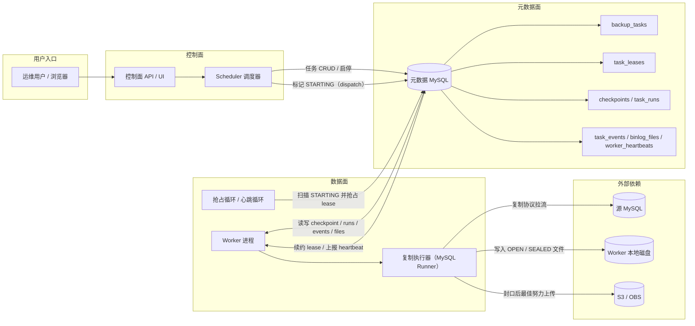
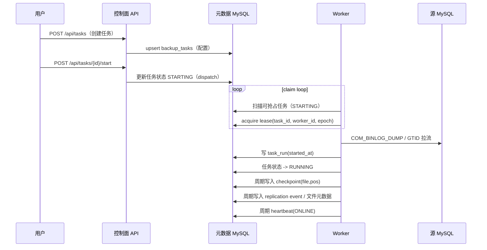
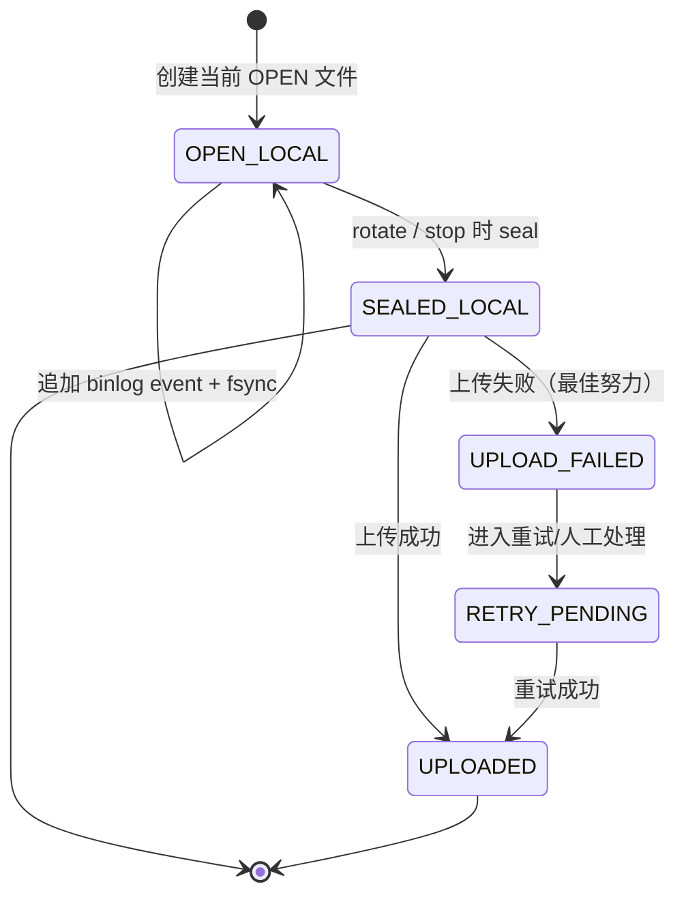
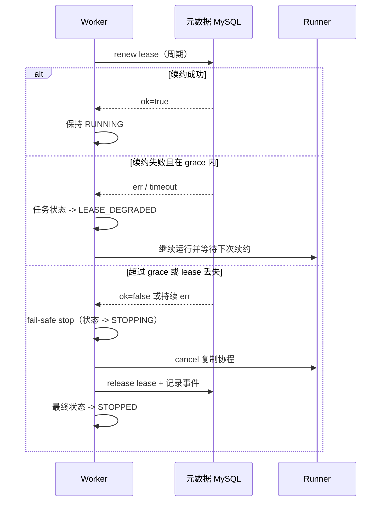
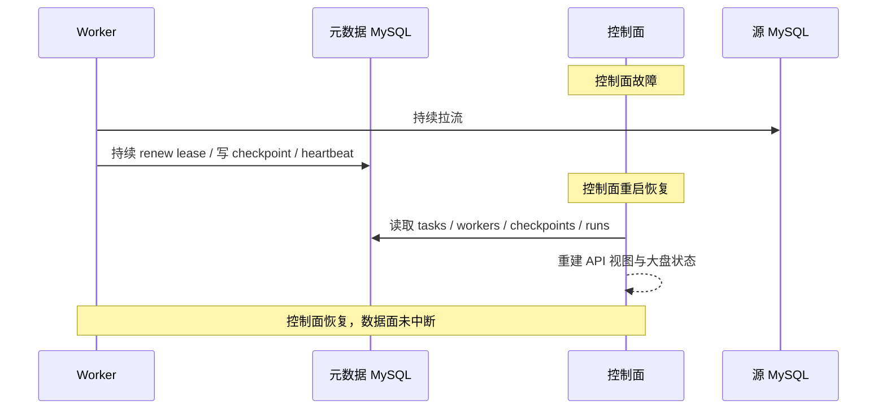
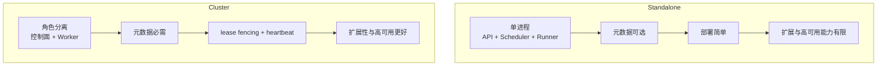

# 架构图（Architecture Diagrams）

本文档提供 `binlog_server` 的核心架构图和关键时序图，覆盖 `standalone` 与 `cluster` 两种模式，并补充复制文件状态机与 lease 故障保护链路。

## 1. 系统组件与职责（Cluster 推荐）

## 2. 任务从创建到运行（控制面 + Worker）

## 3. 复制文件状态机（本地 + 上传）

## 4. Lease 续约与故障保护

## 5. 控制面故障恢复（数据面不中断）

## 6. Standalone 与 Cluster 对比

## 7. 阅读建议

1. 新同学先看第 1 图，再看第 2 图，建立“控制面 + 数据面 + 元数据面”整体模型。
2. 排障时优先看第 4 图和第 5 图，快速判断是 lease 问题还是控制面问题。
3. 运维侧关注第 3 图，明确 `UPLOAD_FAILED` 是“上传失败但不阻断拉流”的语义。
